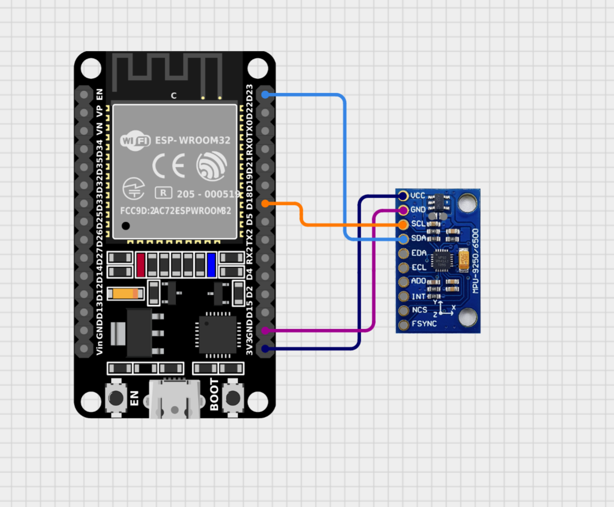

# MPU6050

Example for the MPU6050 6-axis IMU (3-axis accelerometer + 3-axis gyroscope).

Prints accelerometer (g) and gyroscope (deg/s, i.e. rotation rate) to the
console.

## i2c address

Check with [i2c-scanner snippet](../i2c-scanner/): `0x68` (AD0 low).
Pull `ADD`/`AD0` high for `0x69`.

## Circuit image

